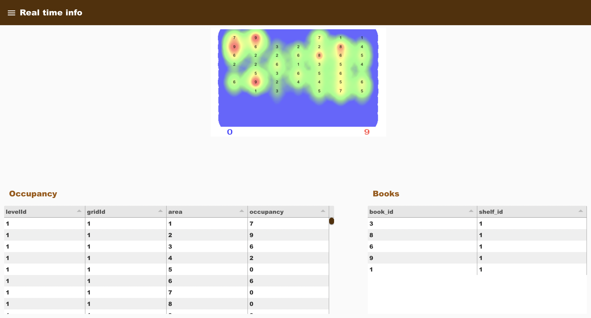
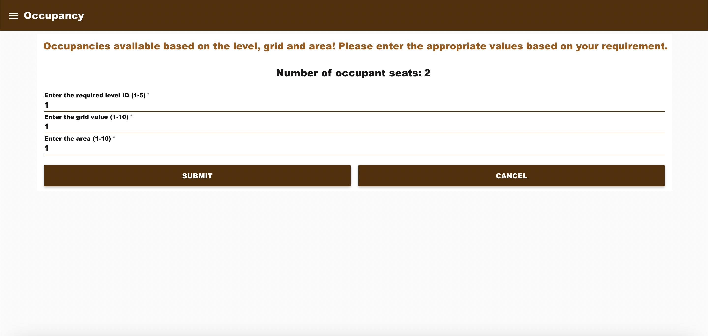
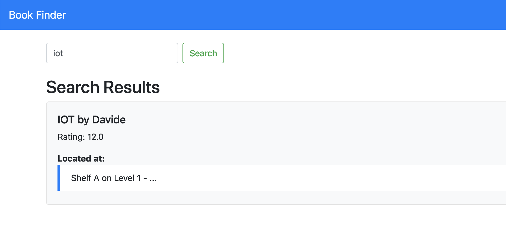
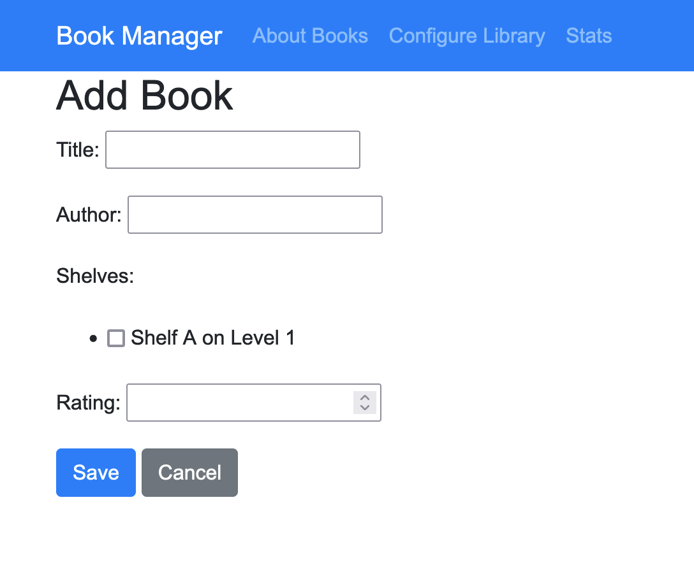

# Smart Library Project

## Overview

This project aims to redefine the library experience, making it more interactive, efficient, and
user-friendly. With RFID-enabled shelves and books and occupancy sensor-based heat maps,
the Smart Library offers a glimpse into the future of library services. These technologies not
only streamline library operations but also significantly improve the accessibility and enjoyment
of library resources for users. Through this project, we also aim to demonstrate the practical
applications and benefits of IoT in academic settings, showcasing how technology can be
harnessed to enhance learning and resource management.

## Features

- RFID-enabled shelves and books
- Real-time occupancy heat maps
- Node-Red dashboard for library users
- Django based system for library staff

## Getting Started

These instructions will get you a copy of the project up and running on your local machine for development and testing purposes.

### Prerequisites

- Docker
- Git (for cloning the repository)

### Installing

1. **Clone the repository**:
   ```sh
   git clone https://github.com/mhreteabeTD/SmartLibrary-1/

### To run the project 
1. Navigate to the project directory
2. $ docker-compose up --build -d

### Project Structure

    book_management/: Django application for managing library books.
    mosquitto/config/: Configuration for Mosquitto MQTT broker.
    occupancy-sensor/: Simulated occupancy sensor data scripts.
    rasberry-pi/: Simulated Raspberry Pi for edge computing.
    rfid-reader/: Simulated RFID reader services.
    docker-compose.yml: Docker services definition file.
    node-red.json: Node-RED flow configuration.
    
### Dashboard for users
Here's a visual overview of the dashboard for library users:
1. 

2. 

3. 


### Dashboard for admin
Here's a visual overview of the dashboard for library admins:



